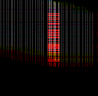

# DeNovoCNN

A deep learning approach to call de novo mutations (DNMs) on whole-exome (WES) and whole-genome sequencing (WGS) data. DeNovoCNN uses trio recalibrated BAM/CRAM + VCF (or tab-separated list of variants) files to generate image-like genomic sequence representations and detect DNMs with high accuracy. <br>
<br>
DeNovoCNN is a combination of three models for the calling of substitution, deletion and insertion DNMs. Each of the model is a 9-layers CNN with [squeeze-and-excitation](https://arxiv.org/pdf/1709.01507.pdf) blocks. DeNovoCNN is trained on ~16k manually curated DNM and IV (inherited and non-DNM variants) sequencing data, generated using [Illumina](https://www.illumina.com/) sequencer and [Sureselect Human
All Exon V5](https://www.agilent.com/cs/library/datasheets/public/AllExondatasheet-5990-9857EN.pdf)/[Sureselect Human
All Exon V4](https://www.agilent.com/cs/library/flyers/Public/5990-9857en_lo.pdf) capture kits.  <br>
<br>
DeNovoCNN returns a tab-separated file of format:
> Chromosome | Start position | End position | Reference | Variant | DNM posterior probability | Mean coverage 

We used **DNM posterior probability >= 0.5** to create a filtered tab-separated file with the list of variants that are likely to be *de novo*.

## How does it work?

DeNovoCNN reads BAM files and iterates through potential DNM locations using the input VCF files to generate snapshots of genomic regions. It stacks trio BAM files to generate and RGB image representation which are passed into a CNN with squeeze-and-excitation blocks to classify each image as either DNM or IV (inherited variant, non-DNM).<br>
<br>
Images are similar to the one that you see below. Each color represents different trio individuals: red - child; green - father; blue - mother. In the example you can see a clear red signal (child reads) in the central position which in this case is a de novo deletion.<br>




## Requirements

[Bcftools 1.8](https://samtools.github.io/bcftools/)
[bgzip 1.4.1](http://www.htslib.org/doc/bgzip.html)
[tabix 0.2.6](http://www.htslib.org/doc/tabix.html)

Python 3.5  
Tensorflow 1.10.0  
Keras 2.2.2  
Pysam  0.8.4  
Pandas 0.22.0  
Pillow 5.2.0  
Opencv 3.4.2 

## Installation
Easiest way of installing is creating an [Anaconda](https://www.anaconda.com/) environment. Dockerized version coming up.

```bash
#Create environment 
conda create -n denovocnn python=3.5

#Activate environment 
conda activate denovocnn

#Install bcftools and tabix+bgzip (single package) 
conda install -c bioconda bcftools
conda install -c bioconda tabix

#Install Python libraries
conda install -c conda-forge tensorflow=1.10.0
conda install -c conda-forge keras=2.2.2
conda install -c bioconda pysam
conda install -c anaconda pandas
conda install -c anaconda pillow
conda install -c conda-forge opencv
```

## Usage

```bash
    cd .../DeNovoCNN
```

### Training
You can train your own network by passing tab-separated files with the following columns:
<ul>
    <li><b>Chromosome</b> - variant chromsome.</li>
    <li><b>Start position</b> - variant start position.</li>
    <li><b>End position</b> - variant end position.</li>
    <li><b>End position</b> - variant end position.</li>
    <li><b>Reference</b> - reference allele.</li>
    <li><b>Variant</b> - variant allele.</li>
    <li><b>De novo assessment</b> - variant inheritance type. Use MV, PV, PV MV, PATERNAL, MATERNAL or SHARED for inherited variants and DNM for <i>de novo</i> mutations.</li>
    <li><b>Child</b> - path to child's BAM file for this variant.</li>
    <li><b>Father</b> - path to fagther's BAM file for this variant.</li>
    <li><b>Mother</b> - path to mother's BAM file for this variant.</li>
</ul>

```bash
KERAS_BACKEND=tensorflow python main.py \
--mode=train \
--build-dataset \
--genome=<PATH_TO_GENOME_FASTA_FILE> \
--train-dataset=<PATH_TO_TRAINING_DATASET_TSV> \
--val-dataset=<PATH_TO_VALIDATION_DATASET_TSV> \
--images=<PATH_TO_FOLDER_SAVING_IMAGES> \
--dataset-name=<DATASET_NAME>

```

### Prediction
To use the pretrained models, you can download them separately:
- [Substitution model](https://drive.google.com/file/d/1YhfoSh5b2HhSS1N1Ii3Jey_qw502VF8I/view?usp=sharing)
- [Deletion model](https://drive.google.com/file/d/1L89lsobNdlCwzbZHzgWQj47FqDE3ElLG/view?usp=sharing)
- [Insertion model](https://drive.google.com/file/d/1JHxDT3mNsVfzws3D9cjHWFsqrAuz-Fmf/view?usp=sharing)

<b>Important: denovoCNN expects recallibrated BAM files using BQSR, more [here](https://gatk.broadinstitute.org/hc/en-us/articles/360035890531-Base-Quality-Score-Recalibration-BQSR-).</b> VCF files can be generated using your preffered variant caller.<br>

If you're running denovoCNN on WGS data, it is recommended to split the VCF files or variants of interest into 10 or more parts and run each of them separately and if possible in parallel. The separation could be done using the following commands:
```bash
   bcftools isec -C $BGZIPPED_CHILD_VCF $BGZIPPED_FATHER_VCF $BGZIPPED_MOTHER_VCF > all_variants.txt
   split -d -l 10000 --additional-suffix=.txt all_variants.txt part_variants

```
The resulting list of variants could be passed as `-vl` parameter. <br>
<br>
To run DeNovoCNN on all possible locations: 
```bash
./apply_denovocnn.sh \
-w=<WORKING_DIRECTORY> \
-cv=<CHILD_VCF> \
-fv=<FATHER_VCF> \
-mv=<MOTHER_VCF> \
-cb=<CHILD_BAM> \
-fb=<FATHER_BAM> \
-mb=<MOTHER_BAM> \
-sm=<SNP_MODEL> \
-im=<INSERTION_MODEL> \
-dm=<DELETION_MODEL> \
-g=<REFERENCE_GENOME> \
-o=<OUTPUT_FILE_NAME>
```

To run DeNovoCNN on a specified list (VARIANT_LIST_TSV) of locations:

```bash
./apply_denovocnn.sh \
-w=<WORKING_DIRECTORY> \
-vl=<VARIANT_LIST_TSV>
-cb=<CHILD_BAM> \
-fb=<FATHER_BAM> \
-mb=<MOTHER_BAM> \
-sm=<SNP_MODEL> \
-im=<INSERTION_MODEL> \
-dm=<DELETION_MODEL> \
-g=<REFERENCE_GENOME> \
-o=<OUTPUT_FILE_NAME>
```
VARIANT_LIST_TSV is a tab-separated file of format:
> Chromosome | Start position | Reference | Variant | Additional info

It could be generated by filtering the locations of interest of the result of this command:

```bash
   bcftools isec -C $BGZIPPED_CHILD_VCF $BGZIPPED_FATHER_VCF $BGZIPPED_MOTHER_VCF > all_variants_list.txt
```


## License
[GNU GPLv3](https://choosealicense.com/licenses/gpl-3.0/)

Copyright (c) 2021 Karolis Sablauskas <br>
Copyright (c) 2021 Gelana Khazeeva
